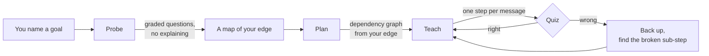
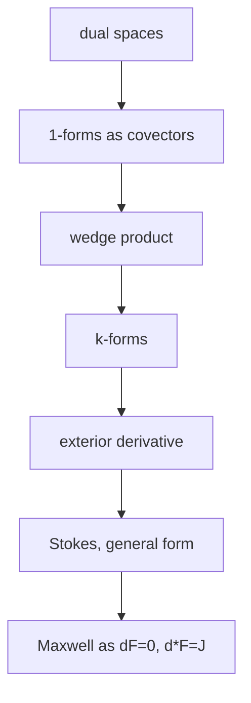

# Using MegaTeach well

> A guide to getting real teaching out of this, rather than a chatbot with extra
> steps. Fifteen minutes of setup buys you a tutor that knows what you know.

Everything here assumes you have run `./install.sh` and can start a `pi` session.
If not, see the [README](README.md) first.

---

## Contents

- [The one thing that makes this different](#the-one-thing-that-makes-this-different)
- [Before your first session](#before-your-first-session)
- [Your first session, step by step](#your-first-session-step-by-step)
- [Teaching from your own material](#teaching-from-your-own-material)
- [Running it in Claude Code, without an API key](#running-it-in-claude-code-without-an-api-key)
- [Reading your probe map](#reading-your-probe-map)
- [Driving the session](#driving-the-session)
- [Worked example: differential forms](#worked-example-differential-forms)
- [Habits that make it much better](#habits-that-make-it-much-better)
- [Troubleshooting](#troubleshooting)
- [What it costs, and how to spend less](#what-it-costs-and-how-to-spend-less)

---

## The one thing that makes this different

Every AI tutor will happily explain anything. The problem is that it explains to
*nobody in particular* — it guesses your level from your phrasing and teaches the
average of everything it has read.

This one measures first.



The mechanism underneath: **when the tutor asks a question, it must commit to the
correct answer before it sees yours.** That single constraint turns a conversation
into a measurement. It cannot decide after the fact that what you said was more or
less right.

> [!IMPORTANT]
> The probe phase will feel wrong the first time. You will answer eight, twelve,
> twenty questions and be told nothing — not even whether you were right. That is
> deliberate. Telling you the answer mid-probe would teach you something you did
> not walk in with, and every later question on that strand would then be
> measuring the tutor's own explanation instead of you.

---

## Before your first session

### 1. Write your PHILOSOPHY.md

This is the highest-leverage ten minutes in the whole system, and the step people
skip.

```bash
cd ~/where-you-study
cp /path/to/MegaTeach/PHILOSOPHY.example.md PHILOSOPHY.md
$EDITOR PHILOSOPHY.md
```

The probe and plan phases are mechanism — they work the same for everyone. *How to
explain* is taste, and it is yours. Without this file you get the repo author's
defaults, which is the same "one outlet teaches many" problem the project exists to
remove.

Be specific and be honest. Vague preferences produce vague teaching:

| Instead of | Write |
|---|---|
| "Explain clearly" | "One reasoning step per message. If a step has two ideas, split it." |
| "Not too formal" | "Motivate with the problem first, then give the definition exactly." |
| "Use examples" | "Concrete instance before the general rule, always." |
| "I know some maths" | "Comfortable with calculus and linear algebra, rusty on proofs, no measure theory." |

The section that pays off most is the one naming what makes you stop reading —
unearned enthusiasm, being told something is "simple", a summary of what is about
to be said. Write those down and they stop happening.

<details>
<summary>Where the file can live</summary>

Searched in order, first hit wins:

1. `./PHILOSOPHY.md` — per project, so "how I want to be taught category theory"
   can differ from "how I want to be taught Rust"
2. `./.teach/PHILOSOPHY.md`
3. `~/.pi/agent/PHILOSOPHY.md` — your global default
4. `~/.claude/PHILOSOPHY.md`

`/philosophy` shows the active one, or scaffolds a starter if there is none.
</details>

### 2. Pick a place to study

Run `pi` from a directory you will come back to. Everything the system remembers
about you lands in `.teach/` there:

```
.teach/
├── probe-log.jsonl   every graded question you have ever answered
├── link.json         which note this project writes lessons into
└── sources/          your ingested PDFs and notes
```

> [!TIP]
> One directory per subject, not one per session. The probe log is cumulative — the
> more sessions you run in the same place, the less re-probing you sit through.

---

## Your first session, step by step

```bash
cd ~/study/differential-geometry
pi
```

```
/link ~/vault/learn/differential-forms.md
/source add ~/course/lecture-notes.pdf
/teach differential forms, up to how Maxwell's equations collapse into two
```

That is the whole interface. What happens next:

| Phase | What you see | What to do |
|---|---|---|
| **Probe** | Multiple-choice questions, one at a time, no feedback | Answer honestly. Pick "I don't know" rather than guessing — it is better data. |
| **Map** | A written summary: solid / shaky / absent per strand | Correct it if it is wrong about you. It will believe you. |
| **Plan** | A Mermaid dependency graph, written to your note | Say if the goal moved, or if a branch is not worth your time. |
| **Teach** | One reasoning step per message, quizzes between | Ask anything, any time. Wrong answers are the system working. |

Open the linked markdown file in Obsidian (or anything that renders LaTeX) while
the session runs. Mathematics, diagrams, and the plan graph render properly there,
and the file survives the terminal.

---

## Teaching from your own material

This is what turns a good generic explanation into one that is useful for *your*
course.

```
/source add ~/course/lectures/     # a file, or a whole directory (.pdf .docx .md .txt)
/source list                       # what's in the library
/source doctor                     # which extractors this machine has, per format
/source remove lecture-3           # take one back out
```

Once sources are added, they **outrank the model's memory** on notation,
conventions, and definitions — exactly the things that differ between courses and
quietly make a correct explanation useless to you. Concretely:

- Every claim drawn from your material is cited as `[lecture-3.pdf p.12]`, so you
  can turn to the page and check it.
- Where your notes and the model's memory disagree, it follows your notes and
  **names the difference** — often the most useful thing it can tell you, because
  that difference is what your marker will be looking for.
- Where your sources are silent, it says so before filling the gap from memory.

> [!NOTE]
> Retrieval is BM25 over page-attributed chunks, computed on your machine. No
> embedding API, no vector database, no key, no network — your notes never leave
> the laptop. The trade is that matching is by keyword, not meaning: a search for
> "linear functionals" will not find a page that only ever says "one-forms". The
> tutor compensates by issuing several queries with different phrasings.

<details>
<summary>PDF and Word support: what to install</summary>

`.md` and `.txt` sources need nothing. `/source doctor` reports what you have for
the two binary formats:

```bash
# PDF
brew install poppler          # macOS — pdftotext, the best output
apt install poppler-utils     # Debian/Ubuntu
brew install mupdf-tools      # alternative
python3 -m pip install pypdf  # no system package needed

# Word (.docx) — usually nothing to install
python3 --version             # a .docx is a zip of XML; stock python3 reads it
```

**Word usually needs nothing.** The first rung is a stdlib Python reader written
against this project's citation contract; macOS `textutil` is the fallback.
pandoc is supported but sits *last*, because it produces the nicest-reading text
and silently discards page breaks — and a citation you cannot turn to is worse
than prose that reads slightly worse.

One honest limitation on Word: a `.docx` has no inherent pages — pagination
happens when it is rendered, and depends on the reader's font and paper size.
Pages are taken from explicit page breaks the author inserted and from the marks
Word leaves where its own layout engine last broke the page. A document with
neither becomes one page and is cited as `[handout.docx]`, with no page number,
rather than with a fabricated one.

Legacy `.doc` is a different, non-zip format. It is rejected with the command to
convert it rather than read as mojibake:

```bash
textutil -convert docx old.doc                      # macOS
libreoffice --headless --convert-to docx old.doc
```

A scanned PDF with no text layer is reported as such rather than ingested empty —
if you see that, you need OCR before this can read it.
</details>

<details>
<summary>Building and searching the library with no session running</summary>

`/source` is a pi command, but the library underneath it is just files, and
`bin/teach-sources.ts` is the same code over `argv`:

```bash
SRC=~/.claude/skills/teach/scripts/sources.sh   # or <repo>/bin/teach-sources.ts

$SRC doctor
$SRC add ~/course/lectures/       # .pdf .docx .md .txt
$SRC list
$SRC search "exterior derivative" --limit 5
$SRC read lecture-3#12 --context 2
```

`--dir <project>` points at a `.teach/` elsewhere; `--json` gives parseable
output with the citation attached to each hit.

This is the cheapest test you can run, and worth running before your first
session: **search your own PDF using the words you would use, not the words the
PDF uses.** If your notes say "one-form" and `$SRC search "linear functional"`
comes back empty, you have found the limit of keyword retrieval for your material
in ten seconds, for free, instead of halfway through a lesson.
</details>

---

## Running it in Claude Code, without an API key

You do not need a model provider. If you have Claude Code, you already have
everything except the pi-specific commands.

```bash
./install.sh --claude
cd ~/where-you-study
claude
```

Then just ask: *teach me differential forms, up to Maxwell*. The skill loads and
runs the same probe → plan → teach loop.

> [!WARNING]
> Logging into pi with a Claude Pro/Max account is **not** the free option. Per
> pi's own documentation, third-party harness usage "draws from extra usage and
> is billed per token, not against Claude plan limits." Running the skill inside
> Claude Code is the path that costs nothing extra.

What changes, and what does not:

| | pi | Claude Code |
|---|---|---|
| Graded question | `quiz` tool | `AskUserQuestion` + `log-answer.sh` |
| Same probe log | ✅ `.teach/probe-log.jsonl` | ✅ the identical file |
| Your sources | `source_search` | `scripts/sources.sh` — same index, same `p.N` citations |
| Lesson file | `note` after `/link` | writes the file you name |
| Slash commands | `/teach` `/probe` `/source` | ask in words instead |

Because both harnesses append to one `probe-log.jsonl` and read one source
library, a topic probed in Claude Code is already measured when you next open
pi. Switching harnesses does not restart the measurement, and does not change
what the tutor believes your textbook says.

### What `AskUserQuestion` cannot do

Three limits are worth knowing before they surprise you mid-probe.

- **Two to four options.** pi's `quiz` takes up to six and adds "I don't know"
  for you. In Claude Code one of the four slots has to be that option, so hard
  questions carry fewer distractors.
- **About sixty seconds to answer.** The annoying one for maths, where a
  question can genuinely need two minutes. Starting to type in the free-text box
  holds the prompt open. If it keeps biting, ask for the question to go into
  your lesson file and answer it by typing instead — it is logged the same way.
- **Subagents cannot ask you anything.** `svg-maker`, `mermaid-maker`, and
  `fact-checker` draw and verify; they never quiz. Only the main session does.

### Checking that it actually graded you

pi's `quiz` cannot be talked out of grading — `correct_index` is a required
parameter, so the model is committed before it sees your answer. In Claude Code
that commitment is the model's own discipline plus the log, which makes the log
worth spot-checking on your first session:

```bash
wc -l .teach/probe-log.jsonl        # note the count
# answer one question
tail -1 .teach/probe-log.jsonl
```

You want one new line per question, written as you go; `strand` reused across
questions in the same strand, so `/probe` can aggregate them; and `correct` /
`admitted` matching what you actually did. If several lines only appear after a
run of questions, the model is reconstructing the probe from memory rather than
committing to it — that is the drift the log exists to catch, and the probe is
worth restarting.

<details>
<summary>If you do want pi, and want it free</summary>

Google's free tier needs no card, and `google` is already pi's default provider:

```bash
export GEMINI_API_KEY=...     # aistudio.google.com
pi
```

OpenRouter also carries a set of `:free` models — `/login openrouter`, then pick
one with `--model`. Expect weaker instruction-following on both: the probe
depends on the model committing to an answer *before* it sees yours, and smaller
models are the ones most likely to quietly skip that step. Check
`.teach/probe-log.jsonl` and confirm `correctIndex` is set on every row.
</details>

---

## Reading your probe map

```
/probe
```

```
differential-forms/one-forms      3/4  solid   today
linear-algebra/dual-spaces        1/3  shaky   2d ago
manifolds/charts                  0/2  absent  2d ago
vector-calculus/stokes            4/4  stale   47d ago
```

| Verdict | Means | What the tutor does |
|---|---|---|
| `solid` | Measured recently, mostly right | Builds on it |
| `shaky` | Measured, mostly wrong | Starts the path here |
| `absent` | Never got one right | Starts below here |
| `stale` | Right, but long ago | Re-probes with one question before trusting it |

`stale` is the one worth understanding. A strand you answered correctly two months
ago is not evidence about today, so the system treats it as unverified rather than
quietly building a lesson on top of it. The horizon is 30 days.

> [!TIP]
> `.teach/probe-log.jsonl` is plain JSONL, one line per question. It is yours, it
> is gitignored by default, and it is the only state the system has — everything
> else is computed from it. Delete a strand's lines and it will re-probe from
> scratch.

---

## Driving the session

You are not a passive recipient. Things worth saying out loud:

| Say this | Effect |
|---|---|
| "That was too big a step." | It splits the step and re-explains. Say it early and often. |
| "I actually know this part already." | Skips ahead — but it will still verify the boundary with one question. |
| "Why is that true?" | Derives it. Off-path questions are always answered, then it returns to the node. |
| "Show me that geometrically." | Delegates to `svg-maker`, which draws, *looks at the render*, and fixes it. |
| "Is that your convention or my notes'?" | Fact-checks against your sources and names the difference. |
| "I forgot the earlier part." | Re-probes that strand instead of assuming the log is still true. |

Getting a quiz wrong is not a failure state. It is the single most useful event in
the session: the tutor stops, backs up, and finds which sub-step actually broke.
Guessing to look good defeats the entire mechanism — the map becomes wrong about
you, and every later lesson is built on the wrong floor.

---

## Worked example: differential forms

<details>
<summary>What a real session looks like end to end</summary>

**Setup**

```
/link ~/vault/learn/forms.md
/source add ~/course/tensor-analysis.pdf
/teach differential forms, up to Maxwell in two equations
```

**Probe** — it lists the strands it will need, then binary-searches each:

> Q1 (vector-calculus/line-integrals) — broad. You get it right → deeper.
> Q2 (vector-calculus/stokes) — you get it wrong → shallower.
> Q3 (vector-calculus/greens-theorem) — right. Boundary located on this strand.
> …repeats for linear algebra, dual spaces, manifolds, tensor notation.

You are told nothing throughout. After ~15 questions:

> "Solid: line integrals, Green's theorem, matrix algebra. Shaky: Stokes in three
> dimensions, dual spaces. Absent: charts, tensor index notation. Your notes use
> the physics convention for index placement, which differs from Wikipedia's —
> I'll follow your notes. [tensor-analysis.pdf p.4]"

**Plan** — a graph, written to your note, starting at *your* edge and not at
chapter one:



**Teach** — one step per message, quizzing as it goes. When you miss the question
after "wedge product", it does not push on to k-forms; it backs up, finds that the
antisymmetry was the part that did not land, and re-explains from there.

</details>

---

## Habits that make it much better

1. **Answer "I don't know" honestly.** It is treated as data, not failure, and it
   is far more useful than a lucky guess.
2. **Study in the same directory every time.** The probe log compounds.
3. **Add your course material before the first probe**, not after — probe questions
   drawn from your own syllabus measure the thing you are actually examined on.
4. **Interrupt.** "Too fast", "too slow", "I don't care about this branch" all work,
   and the session is fitted to one person: you.
5. **Update `PHILOSOPHY.md` after a few sessions.** You will discover preferences
   you did not know you had. That file is meant to be edited, not written once.
6. **Read the note afterwards.** The lesson file with the graph and derivations is
   the artifact; the terminal scrollback is not.

---

## Troubleshooting

| Symptom | Cause | Fix |
|---|---|---|
| "No PHILOSOPHY.md found" at session start | You have not written one | `/philosophy` scaffolds a starter |
| Probe asks ten questions at the same level | The prompt needs tuning for your subject | Read `.teach/probe-log.jsonl`, then edit `skills/teach/SKILL.md` — this is expected iteration |
| `/source add` fails on a PDF | No text extractor installed | `/source doctor`, then install poppler or pypdf |
| PDF added but searches find nothing | Scanned images, no text layer | Needs OCR first |
| Search misses a passage you know is there | BM25 is lexical | Search the words the source uses, not your paraphrase |
| Lessons not appearing in Obsidian | No file linked | `/link ~/vault/path/note.md` |
| Nothing in `/probe` after a session | The log could not be written | Check the directory is writable; the tool warns when the write fails |
| Diagrams never appear | The subagent needs a working `pi` on PATH | `/source doctor` is unrelated; check `pi --version` |

---

## What it costs, and how to spend less

The probe is turn-heavy by design — that is where the value is, so the wrong
economy is fewer questions.

- **Use a cheaper model for probing, a stronger one for teaching.** Probing is
  question generation and grading; teaching is where reasoning quality shows.
- **Let subagents carry the expensive loops.** `svg-maker` renders and re-renders
  images in its own context window; that never touches your lesson's context. Give
  it a cheaper model via the `model:` field in `agents/svg-maker.md`.
- **Study in one directory.** Every strand already measured is one you do not pay
  to re-probe.

---

## Where to go next

- [README](README.md) — install and the short version
- [PLAN.md](PLAN.md) — the roadmap, what is built, and the questions still open
- [CONTRIBUTING.md](CONTRIBUTING.md) — the one rule: do not send a PR that changes
  how the tutor explains things. That is what `PHILOSOPHY.md` is for.
